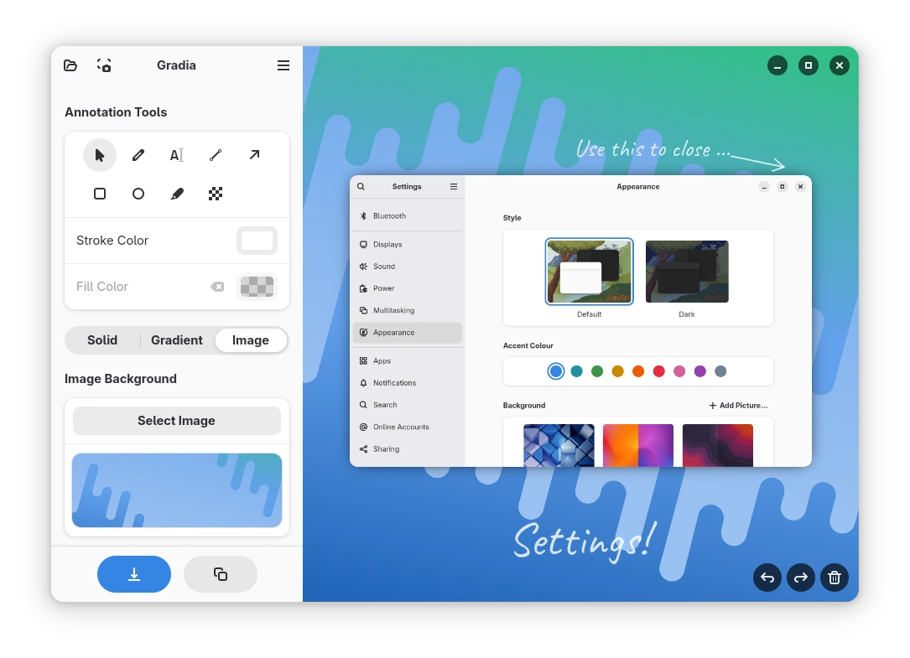
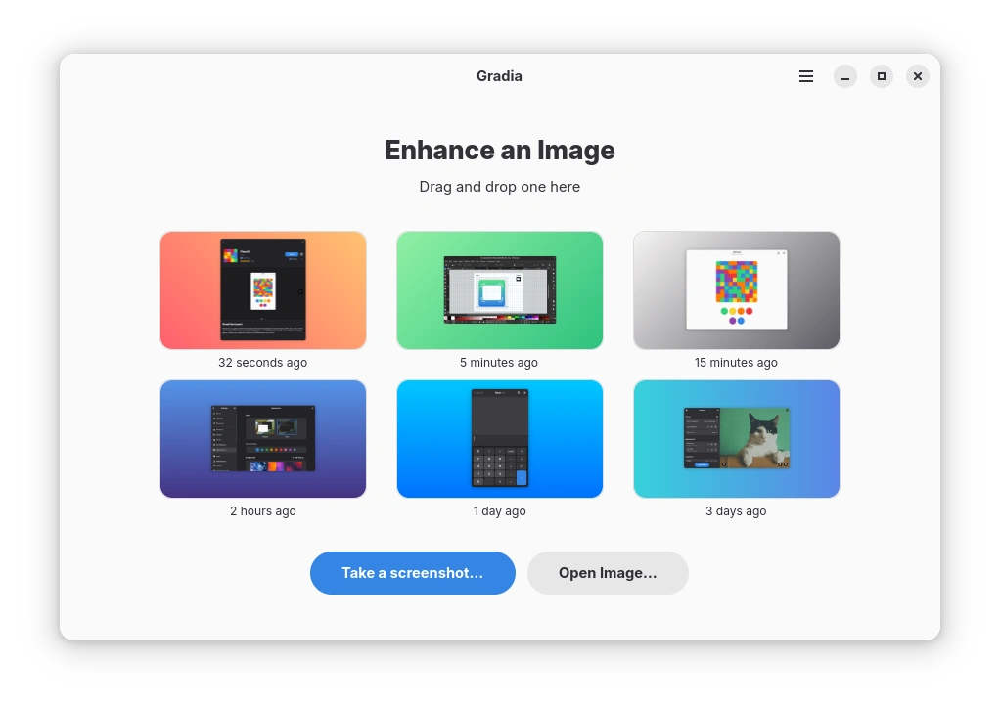

  

<h1 align="center">Gradia</h1>

<em>Make your screenshots ready for the world.</em>

  On social media, it's often hard to control how your images appear to others.
  Transparent or oddly sized images—like screenshots—often don't display well.
  Fixing these issues can feel like more trouble than it's worth.

  Gradia aims to alleviate that problem by allowing you to quickly edit images to address these issues,
  while also offering options to enhance their overall appearance.

  

---

Gradia allows you to quickly modify screenshots of application windows to put them better in context.

> [!IMPORTANT]
> The [GNOME Code of Conduct](https://conduct.gnome.org) applies to this project, including this repository.

## Screenshots

  
  

